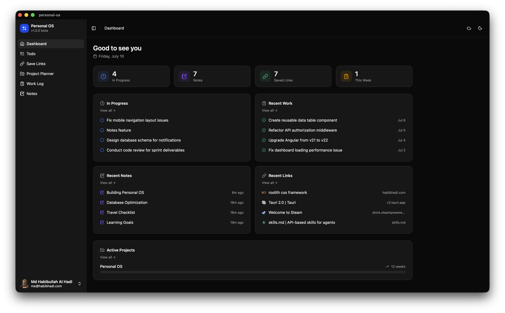
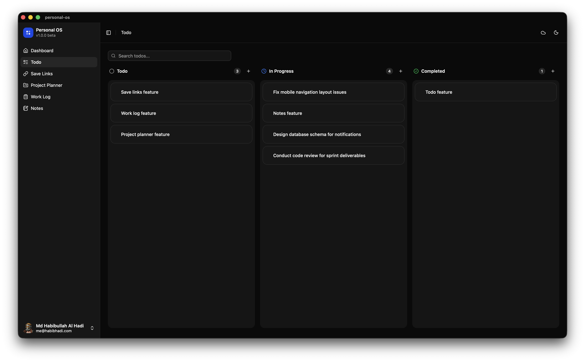
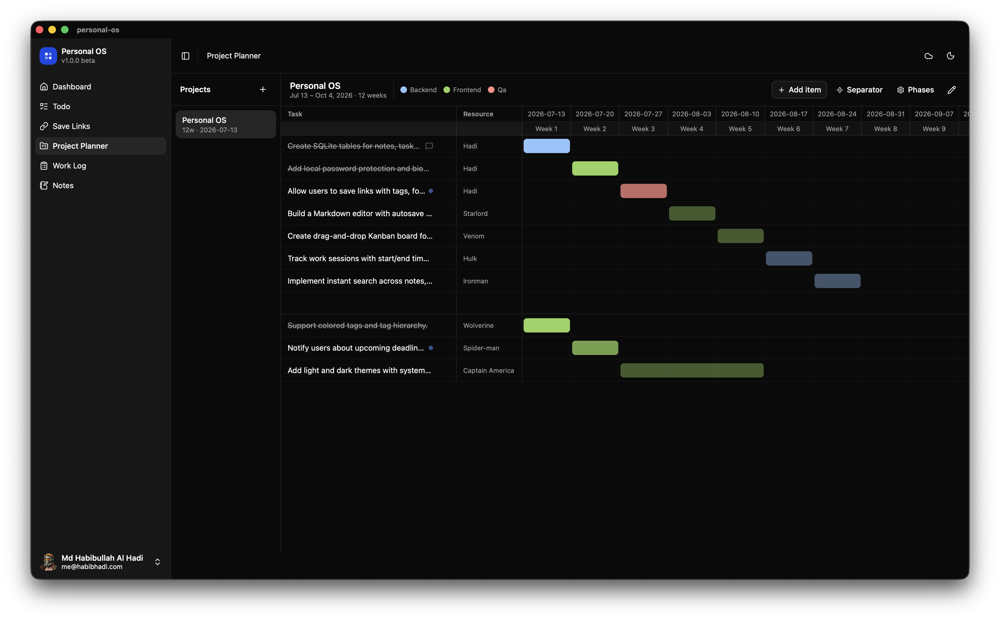
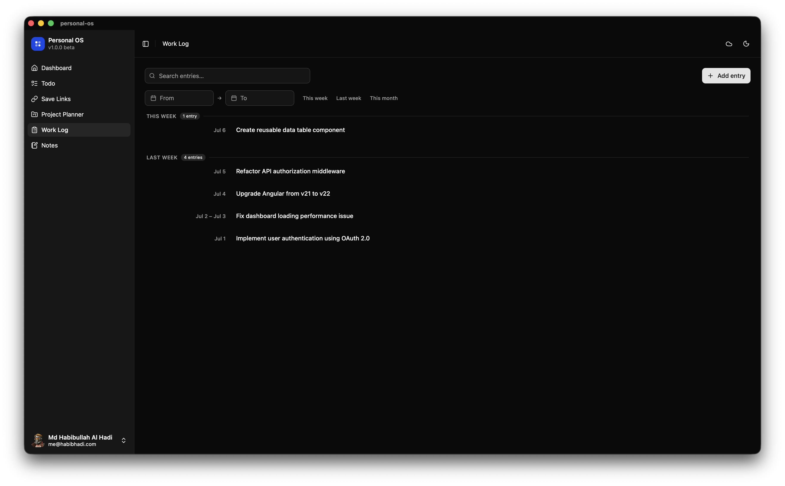
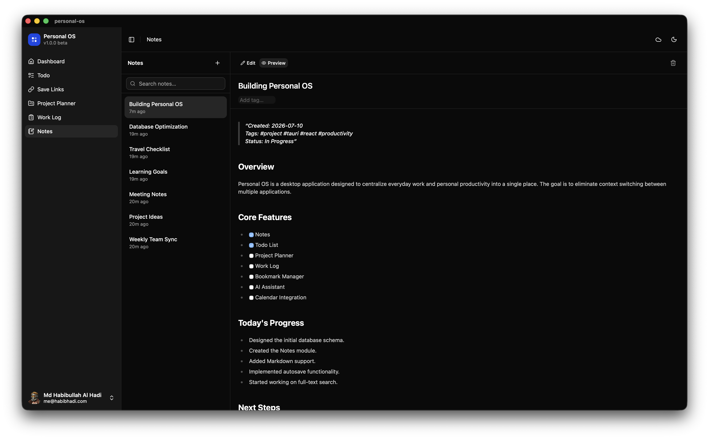
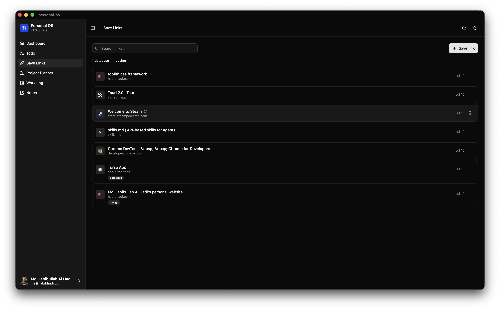
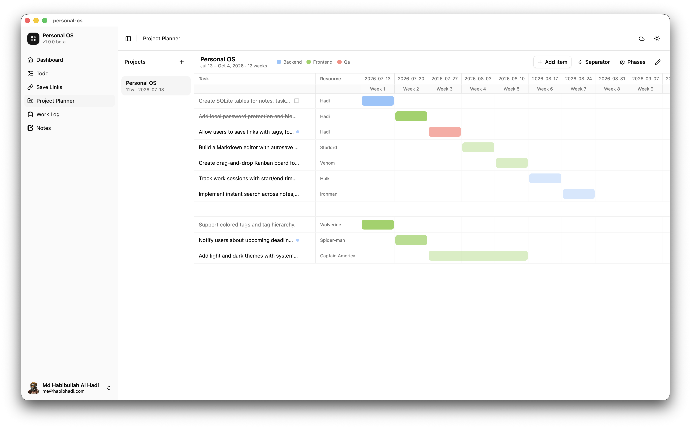

<div align="center">


# Personal OS

**Your personal operating system for tasks, notes, links, work logs, and project timelines — all in one local-first desktop app.**

Built with Tauri v2 · React 19 · TypeScript · Tailwind CSS v4

</div>

---

## Overview

Personal OS centralizes everyday work and personal productivity into a single desktop app, eliminating the constant context-switching between separate tools. Everything lives locally in SQLite by default, with **optional cloud sync** via Turso so your data follows you across machines.

## Features

- **Dashboard** — an at-a-glance overview of in-progress tasks, recent work, notes, links, and active project timelines.
- **Todo** — a drag-and-drop Kanban board (Todo / In Progress / Completed) with priorities, due dates, and search.
- **Save Links** — bookmark any URL with auto-fetched title and favicon, organize with tags, filter and search.
- **Project Planner** — a simplified Gantt chart per project with custom colour-coded phases, resources, week ranges, statuses, and Jira ticket links.
- **Work Log** — log completed work grouped by week, with start/end dates, tags, and date-range filtering.
- **Notes** — a Markdown editor with live preview, tags, and auto-save.
- **Light & dark themes** — with system-preference support.
- **Optional cloud sync** — local-first SQLite, with last-write-wins sync to Turso when enabled.

---

## Screenshots

### Dashboard


### Todo — Kanban board


### Project Planner — Gantt chart


### Work Log


### Notes — Markdown with live preview


### Save Links


### Light mode


---

## Tech Stack

| Layer      | Tech                                                        |
| ---------- | ---------------------------------------------------------- |
| Desktop    | Tauri v2 (Rust, edition 2021)                              |
| Frontend   | React 19, TypeScript ~5.8, Vite 7                          |
| Styling    | Tailwind CSS v4, tw-animate-css                            |
| Components | shadcn (`new-york`), Radix, lucide-react                  |
| State      | Zustand                                                    |
| Local DB   | SQLite (`tauri-plugin-sql`)                               |
| Cloud sync | Turso (libSQL HTTP API)                                    |

---

## Getting Started

### Prerequisites

- [Node.js](https://nodejs.org/) (LTS)
- [Rust](https://www.rust-lang.org/tools/install) toolchain
- Platform dependencies for Tauri — see the [Tauri prerequisites guide](https://tauri.app/start/prerequisites/)

### Install

```bash
npm install
```

### Develop

```bash
npm run tauri dev      # full desktop app in dev mode
```

Other useful commands:

```bash
npm run dev            # Vite dev server only (port 1420)
npm run build          # typecheck + build frontend
npm run tauri build    # build production desktop bundle
```

---

## Cloud Sync (optional)

Personal OS runs fully **local-first** — no account or network needed. To sync across
machines, connect a [Turso](https://turso.tech/) database from within the app (cloud
icon in the header). Data syncs bidirectionally with last-write-wins conflict
resolution. Switch back to local mode any time.

---

## License

© 2026 Md Habibullah Al Hadi. All rights reserved.
